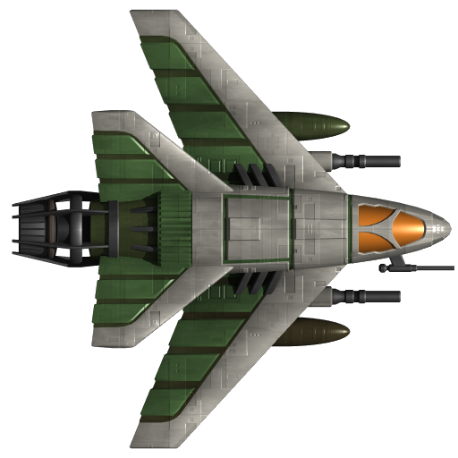

# SpaceShooter Game

a simple space shooter game created using C++ & SFML.

[my repositiory](https://www.youtube.com/results?search_query=.md+files)
---
**Goals:**
1. [Why to use SFML?](#why-sfml)
1. [some sus code](#creating-process--code)
1. third
1. fourth

## subheader test
how to install ? : `just download the .exe file from the following link : https://www.google.com`

## creating process & code:

```cpp
Enemy::Enemy(Texture* _texture, Vector2u windowSize) {
	this->texture = _texture;
	this->shape.setTexture(*texture);
	shape.setScale({ 0.12, 0.12 });
	shape.setPosition(windowSize.x, rand() % windowSize.y - this->shape.getGlobalBounds().height);

	//health
	health_bar = new HealthBar(5.f, 100.f, 100.f);
	health_bar->shape.setFillColor(Color::Green);
}

void Enemy::decreaseHP(float amount) {
	this->health_bar->decreaseHealth(amount);
}

```

---


## Why SFML?
- simple and easy
- fast in rendering time
- openGL based



## Road map

- [x] Task #1
- [ ] Task #2

---

| Name | Current State | Next State |
| :---- | :---- | :---- |
| green | green | yellow |
| Yellow | Yellow | Red |